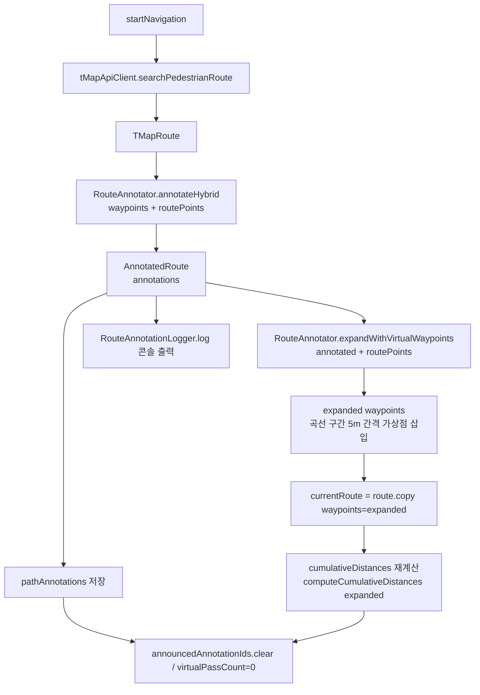
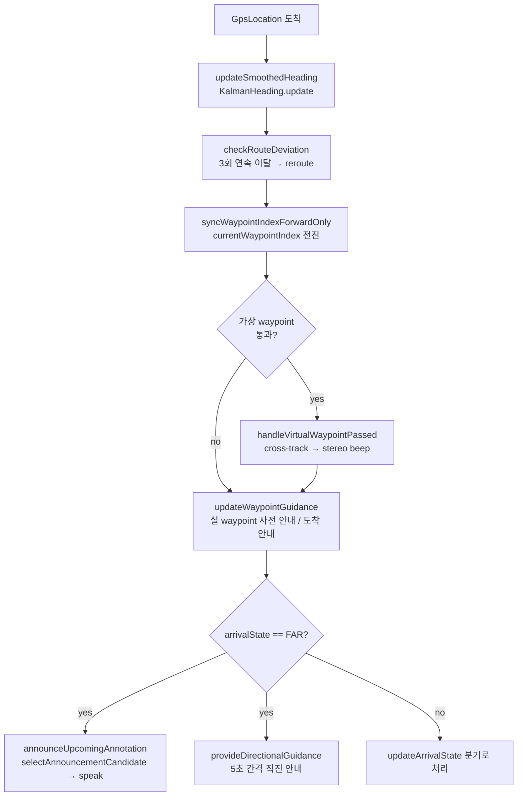

# 현재 네비게이션 알고리즘 동작 문서 (코드 기반)

## 1. 개요

- **분석 기준 브랜치**: `docs/alogorithm` (코드는 `main` 머지 직후 상태와 동일)
- **분석 기준 커밋**: `b355ef72a0e97b2a4b014636e66ae12000009f81` (Merge PR #37 `walking_final`)
- **작성 날짜**: 2026-05-25
- **작성자**: 지민 (iOS 담당)
- **작업 종류**: READ-ONLY 분석. 코드 파일 무수정. 본 문서 한 개만 생성.

### 알고리즘이 해결하는 문제

시각장애 보행자가 TMap 보행자 경로를 따라 이동할 때, GPS 위치/속도/방위각 만으로
"앞쪽에 곡선/회전이 있다" 를 음성으로, "지금 경로의 어느 쪽으로 쏠리고 있다" 를
스테레오 비프로 미리 알려주는 것이 목표다. 즉석에서 코너를 감지하는 1차 설계
(즉시 분석 + Trust Score) 가 magnetic heading 노이즈로 실측에서 부정확하게 동작했기
때문에, **경로 수신 시 한 번 사전 분석(annotate)** 해 두고 진행 중에는 사용자
누적 거리로만 발화 시점을 잡는 방식으로 단순화돼 있다.

### 핵심 입력과 출력

| 단계 | 입력 | 출력 |
|------|------|------|
| 경로 수신 (1회) | `TMapRoute(waypoints, routePoints, segments)` | `AnnotatedRoute(waypoints, annotations: List<PathAnnotation>)` + 가상 waypoint 가 삽입된 확장 waypoint 리스트 |
| 위치 업데이트 (GPS tick마다) | `GpsLocation(lat, lon, bearing, speed, accuracy)` | `_guidanceMessage: StateFlow<String>` (음성용 텍스트), `SpatialBeeper.playBeep(pan, tone, count)` (스테레오 비프) |

---

## 2. 파일 구성

### 2.1 `shared/src/commonMain/kotlin/com/example/safewalknav/navigation/tbfw/`

| 파일명 | 역할 (한 줄) | 주요 public API |
|--------|-------------|-----------------|
| [NavigatorConfig.kt](../../shared/src/commonMain/kotlin/com/example/safewalknav/navigation/tbfw/NavigatorConfig.kt) | RouteAnnotator + 가상 waypoint 안내의 튜닝 임계값 묶음 (data class) | `NavigatorConfig()`, `NavigatorConfig.defaults()` |
| [PathAnnotation.kt](../../shared/src/commonMain/kotlin/com/example/safewalknav/navigation/tbfw/PathAnnotation.kt) | 경로 분류 결과를 담는 데이터 모델 + enum | `PathAnnotation`, `AnnotatedRoute`, `PathSegmentType`, `TurnDirection` |
| [RouteAnnotator.kt](../../shared/src/commonMain/kotlin/com/example/safewalknav/navigation/tbfw/RouteAnnotator.kt) | waypoint/폴리라인 분석 → annotation 생성 + 가상 waypoint 보간 | `annotate(waypoints)`, `annotateHybrid(waypoints, routePoints)`, `expandWithVirtualWaypoints(annotated, routePoints)`, `RouteAnnotator.normalizeAngle(deg)` (static) |
| [AnnouncementSelector.kt](../../shared/src/commonMain/kotlin/com/example/safewalknav/navigation/tbfw/AnnouncementSelector.kt) | 사용자 누적 거리 기준으로 다음에 발화할 annotation 선택 | `selectAnnouncementCandidate(annotations, userCumulativeDistance, announcedIds, config)` (internal), `announceDistanceFor(type, config)` (internal) |
| [MessageBuilder.kt](../../shared/src/commonMain/kotlin/com/example/safewalknav/navigation/tbfw/MessageBuilder.kt) | 한국어 안내 문장 생성 (순수 함수, 외부 상태 없음) | `MessageBuilder.buildAnnotationAnnounce(annotation)`, `buildInitialHeadingMessage(diffDeg, tolerance)`, `buildFlatPosePromptMessage()` |
| [RouteAnnotationLogger.kt](../../shared/src/commonMain/kotlin/com/example/safewalknav/navigation/tbfw/RouteAnnotationLogger.kt) | annotation 결과와 segment 각도를 사람이 읽기 좋게 콘솔에 출력 (디버그용) | `RouteAnnotationLogger.log(annotated, routeName, totalDistanceM, config)` |

### 2.2 `shared/src/commonTest/kotlin/com/example/safewalknav/navigation/tbfw/`

| 파일명 | 검증 대상 |
|--------|----------|
| [RouteAnnotatorTest.kt](../../shared/src/commonTest/kotlin/com/example/safewalknav/navigation/tbfw/RouteAnnotatorTest.kt) | `annotate`, `annotateHybrid`, `expandWithVirtualWaypoints`, `normalizeAngle` |
| [AnnouncementSelectorTest.kt](../../shared/src/commonTest/kotlin/com/example/safewalknav/navigation/tbfw/AnnouncementSelectorTest.kt) | `selectAnnouncementCandidate`, `announceDistanceFor`, `computeCumulativeDistances` |
| [MessageBuilderTest.kt](../../shared/src/commonTest/kotlin/com/example/safewalknav/navigation/tbfw/MessageBuilderTest.kt) | `buildAnnotationAnnounce`, `buildInitialHeadingMessage` |

### 2.3 본 문서에서 참고하는 tbfw 외 파일

| 파일 | 본 문서와의 관계 |
|------|------|
| [shared/.../navigation/NavigationManager.kt](../../shared/src/commonMain/kotlin/com/example/safewalknav/navigation/NavigationManager.kt) | tbfw 의 모든 클래스를 호출하는 진입점. `startNavigation`, `updateLocation`, `syncWaypointIndexForwardOnly`, `announceUpcomingAnnotation`, `handleVirtualWaypointPassed` 가 핵심 |
| [shared/.../navigation/geo/BearingMath.kt](../../shared/src/commonMain/kotlin/com/example/safewalknav/navigation/geo/BearingMath.kt) | `bearing()`, `distanceBetween()`, `computeCumulativeDistances()` — RouteAnnotator/NavigationManager 양쪽이 의존 |
| [shared/.../navigation/geo/CrossTrack.kt](../../shared/src/commonMain/kotlin/com/example/safewalknav/navigation/geo/CrossTrack.kt) | `computeSignedCrossTrack()` — `handleVirtualWaypointPassed` 가 경로 이탈 부호/크기 계산에 사용 |
| [shared/.../navigation/tmap/TMapRoute.kt](../../shared/src/commonMain/kotlin/com/example/safewalknav/navigation/tmap/TMapRoute.kt) | `TMapRoute`, `Waypoint` (isVirtual/sourceRoutePointIdx/curveDirection/bearingToNext 포함), `RouteSegment`, `LatLng`, `ArrivalState`, `RiskLevel` |

---

## 3. 데이터 흐름

### 3.1 경로 수신 시 (1회)

[NavigationManager.kt:261](../../shared/src/commonMain/kotlin/com/example/safewalknav/navigation/NavigationManager.kt:261) `startNavigation()`



핵심 순서 (라인 번호는 `NavigationManager.kt`):
1. L281 `tMapApiClient.searchPedestrianRoute(...)` → `TMapRoute`
2. L361~366 `RouteAnnotator(navigatorConfig).annotateHybrid(route.waypoints, route.routePoints)` → `AnnotatedRoute`
3. L373~378 `annotator.expandWithVirtualWaypoints(annotatedResult, route.routePoints)` → 가상 waypoint 가 섞인 새 waypoint 리스트
4. L379 `currentRoute = route.copy(waypoints = expandedWaypoints)`
5. L385 `cumulativeDistances = computeCumulativeDistances(currentRoute!!.waypoints)` — 가상 waypoint 포함 누적 거리
6. L394~398 `RouteAnnotationLogger.log(...)` — 콘솔 디버그 출력 (튜닝용)

### 3.2 GPS 위치 업데이트 시 (tick마다)

[NavigationManager.kt:558](../../shared/src/commonMain/kotlin/com/example/safewalknav/navigation/NavigationManager.kt:558) `updateLocation(GpsLocation)`



핵심 순서 (라인 번호는 `NavigationManager.kt`):
1. L568 `updateSmoothedHeading(rawBearing, speed, accuracy)` → Kalman 필터된 heading
2. L597 `checkRouteDeviation(...)` → 이탈 3회 누적 시 `reroute(...)`
3. L608 `syncWaypointIndexForwardOnly(it, currentLat, currentLon, userBearing)` — 가상 waypoint 통과 시 `handleVirtualWaypointPassed` 호출 (L1173)
4. L689 `updateWaypointGuidance(...)` — 실 waypoint 사전 안내(30m/50m)와 도착 안내(10m)
5. L693 `announceUpcomingAnnotation(currentLat, currentLon, speed)` — 사전 분석된 annotation 발화
6. L698 `provideDirectionalGuidance(...)` — 무음 방지 5초 간격 직진 안내

### 3.3 RouteAnnotator 와 진행 추적이 만나는 지점

| 지점 | 위치 | 무슨 일이 일어나나 |
|------|------|--------------------|
| **A. annotation 생성 시점** | `startNavigation` L362 | RouteAnnotator 가 만든 `pathAnnotations` 가 NavigationManager 인스턴스 필드에 저장됨. 이후 모든 발화의 단일 출처. |
| **B. 가상 waypoint 시점** | `startNavigation` L373 | `expandWithVirtualWaypoints` 가 곡선 구간에 5m 점을 끼워 넣음. 이 점들이 routePoints 가 아닌 waypoints 에만 들어가므로 폴리라인 그리기엔 영향 없음. |
| **C. annotation 발화 시점** | `announceUpcomingAnnotation` L1540 | tick마다 `userCumulativeDistance` 계산 → `selectAnnouncementCandidate` 호출 → 후보 있으면 `speak()`. |
| **D. 가상 waypoint 통과 시점** | `syncWaypointIndexForwardOnly` L1126 → `handleVirtualWaypointPassed` L1474 | `currentWaypointIndex` 가 가상점에 도달해 전진하는 순간 비프 안내 호출. |

---

## 4. RouteAnnotator 의 동작 상세

### 4.1 "어노테이션" 의 정확한 의미 (필드 단위)

[PathAnnotation.kt:51-60](../../shared/src/commonMain/kotlin/com/example/safewalknav/navigation/tbfw/PathAnnotation.kt:51)

| 필드 | 타입 | 의미 |
|------|------|------|
| `startWaypointIndex` | `Int` | 분석 구간이 시작되는 waypoint 인덱스. **annotation 의 고유 ID** 로도 쓰임 (announcedAnnotationIds 의 키). |
| `endWaypointIndex` | `Int` | 분석 구간이 끝나는 waypoint 인덱스. 단일 회전이면 `startIdx + 1`, 곡선이면 scanCurve 가 묶은 마지막 인덱스. |
| `type` | `PathSegmentType` | `STRAIGHT / SLIGHT_CURVE / CURVE / SLIGHT_TURN / TURN / SHARP_TURN / INTERNAL_CURVE` |
| `direction` | `TurnDirection` | `LEFT / RIGHT / NONE`. 부호 ≥ 0 이면 RIGHT (시계 방향), <0 이면 LEFT |
| `totalAngle` | `Double` | 누적 각도 변화 (부호 있음, -180~+180). 회전이면 단일 delta, 곡선이면 같은 부호 deltas 의 합 |
| `peakAngle` | `Double` | 단일 sub-segment 최대 각도 변화 (부호 있음) |
| `distanceFromStartM` | `Double` | 경로 시작점부터 annotation 시작 waypoint 까지의 누적 거리 (m). `selectAnnouncementCandidate` 가 사용자 진행 거리와 비교 |
| `announceMessage` | `String` | `MessageBuilder.buildAnnotationAnnounce(this)` 가 채운 최종 한국어 텍스트. STRAIGHT 또는 direction == NONE 이면 빈 문자열 |

### 4.2 어떤 기준으로 어느 지점에 annotation 이 붙는가

[RouteAnnotator.kt:46](../../shared/src/commonMain/kotlin/com/example/safewalknav/navigation/tbfw/RouteAnnotator.kt:46) `annotate(waypoints, segments)` 의 두 스테이지:

**Stage A — waypoint 간 분석** (`waypoints.size >= 3` 일 때 실행, [L54-121](../../shared/src/commonMain/kotlin/com/example/safewalknav/navigation/tbfw/RouteAnnotator.kt:54))

```
for i in 0 .. size - 3:
    a, b, c = waypoints[i], waypoints[i+1], waypoints[i+2]
    d1 = distance(a, b);  d2 = distance(b, c)
    if d1 < minSegmentDistanceM (3m) or d2 < minSegmentDistanceM:
        i++; continue   # 짧은 구간 — 판정 보류
    delta = normalize(bearing(b→c) - bearing(a→b))

    if |delta| >= turnPeakThresholdDeg (30°):
        # 회전 — buildTurnAnnotation, 강도(SHARP/TURN/SLIGHT) 는 absDelta 기준
        push TURN annotation; i++
    elif |delta| >= noiseAngleThresholdDeg (10°):
        # 곡선 후보 — scanCurve 로 같은 부호 연속 묶기
        scan = scanCurve(waypoints, i)
        if scan.consistencyRatio >= 0.75 and |scan.cumulative| >= 30°:
            push CURVE annotation (강도: 35° 미만 → SLIGHT_CURVE, 이상 → CURVE)
            i = scan.endIdx
        else: i++
    else: i++   # 직진 / 노이즈
```

**Stage B — segment 내부 폴리라인 분석** ([L124-131](../../shared/src/commonMain/kotlin/com/example/safewalknav/navigation/tbfw/RouteAnnotator.kt:124))

`segments` 가 비어있지 않으면 각 `RouteSegment.points` (LineString) 의 슬라이딩 윈도우로
누적 곡률을 구해 `INTERNAL_CURVE` 를 별도 검출 (TMap 이 단일 LineString 으로 묶어
보낸 내부 곡선 케이스 대응). `scanInternalCurve` 는 끊는 조건이 없고 전체 누적 후
한번에 판정.

**annotateHybrid (실제 NavigationManager 가 호출)** ([L157](../../shared/src/commonMain/kotlin/com/example/safewalknav/navigation/tbfw/RouteAnnotator.kt:157))

`annotate(waypoints)` 로 1차 결과 → 직진 판정된(annotation 비포함) waypoint 구간만 골라
그 사이의 `routePoints` 폴리라인 누적 곡률을 별도 검사 → 보조 annotation 으로 머지.
짧은 구간(< `minSegmentDistanceM * 5 = 15m`)은 보조 검사도 건너뜀.

### 4.3 annotation → 안내 메시지 매핑

`MessageBuilder.buildAnnotationAnnounce(annotation)` ([MessageBuilder.kt:20](../../shared/src/commonMain/kotlin/com/example/safewalknav/navigation/tbfw/MessageBuilder.kt:20))

| `PathSegmentType` | `direction` | 메시지 |
|-------------------|-------------|--------|
| STRAIGHT (모든 dir) | — | `""` (빈 문자열) |
| 모든 type, NONE | — | `""` (빈 문자열) |
| SLIGHT_CURVE | LEFT/RIGHT | "앞쪽 길이 {왼/오른}쪽으로 완만하게 휘어집니다. 인도 방향을 따라 이동하세요." |
| CURVE | LEFT/RIGHT | "앞쪽 길이 {왼/오른}쪽으로 휘어집니다. 인도 방향을 따라 이동하세요." |
| INTERNAL_CURVE | LEFT/RIGHT | "앞쪽 도로가 {왼/오른}쪽으로 휘어집니다. 인도를 따라가세요." |
| SLIGHT_TURN | LEFT/RIGHT | "잠시 후 {왼/오른}쪽으로 살짝 꺾어집니다." |
| TURN | LEFT/RIGHT | "잠시 후 {왼/오른}쪽으로 꺾어집니다." |
| SHARP_TURN | LEFT/RIGHT | "잠시 후 {왼/오른}쪽으로 크게 꺾어집니다." |

빈 문자열은 `selectAnnouncementCandidate` 에서 `isBlank()` 로 걸러 발화되지 않는다.

### 4.4 로거가 기록하는 내용

`RouteAnnotationLogger.log(annotated, routeName, totalDistanceM, config)` ([RouteAnnotationLogger.kt:32](../../shared/src/commonMain/kotlin/com/example/safewalknav/navigation/tbfw/RouteAnnotationLogger.kt:32))

호출 시점: `startNavigation` L394 — 경로 수신 직후 한 번.

출력 항목:
- 경로 이름, 총 waypoint 수, 총 거리, 사용한 임계값 (`noise/peak/cumulative/minSeg`)
- `[Annotations]` 섹션 — 각 annotation 의 `(start..end)`, type, direction, cumulative°, peak°, distFromStart, 그리고 announceMessage
- `[Segment-by-segment angle deltas]` 섹션 — i→i+1 의 거리 d, 각도 delta, 판정 태그 (`짧은 구간/무시`, `직진/노이즈`, `곡선 후보`, `회전 (peak)`)

이 로그는 콘솔에만 찍힌다. CSV 또는 파일 저장 로직은 별도(HeadingLogger 계열).

---

## 5. 진행 추적 / 안내 생성 로직

### 5.1 사용자 위치가 어느 구간에 있는지 판정

`syncWaypointIndexForwardOnly` ([NavigationManager.kt:1126](../../shared/src/commonMain/kotlin/com/example/safewalknav/navigation/NavigationManager.kt:1126))

`currentWaypointIndex` 는 절대 뒤로 가지 않는 **forward-only 정수**. 매 tick 마다 다음을 반복:

1. `currentWaypointIndex` 위치 waypoint 까지의 GPS 직선거리가 `passThreshold` 이내 (가상 7m / 일반 10m) 인가?
2. 그 waypoint 의 polyline 인덱스가 `currentRoutePointIndex + 2` 보다 작은가? (= 경로상 이미 지나갔는가)
3. 둘 다 만족하면 `currentWaypointIndex++`. 한 tick 에서 여러 가상점을 연속 통과할 수 있음.

가상 waypoint 통과는 마지막 1개만 `handleVirtualWaypointPassed` 로 넘김 (청각 피로 완화).

`currentRoutePointIndex` 는 `findMinDistanceToRoute` (L1051) 에서 갱신. 속도가 빠를수록
탐색 범위 확장 (`lookAhead = 5 + min(speed*10, 35)`). 뒤로는 가지 않음 (forward-only).

### 5.2 다음 annotation 으로 넘어가는 조건

[AnnouncementSelector.kt:20](../../shared/src/commonMain/kotlin/com/example/safewalknav/navigation/tbfw/AnnouncementSelector.kt:20) `selectAnnouncementCandidate`

```
for ann in annotations:
    if ann.startWaypointIndex in announcedIds: skip
    if ann.announceMessage.isBlank(): skip
    triggerDist = announceDistanceFor(ann.type, config)
    gap = ann.distanceFromStartM - userCumulativeDistance
    if gap in 0.0..triggerDist: return ann   # firstOrNull — 리스트 순서대로 첫 번째
return null
```

`triggerDist` ([AnnouncementSelector.kt:45](../../shared/src/commonMain/kotlin/com/example/safewalknav/navigation/tbfw/AnnouncementSelector.kt:45)):
- `SHARP_TURN` → 25m
- `TURN`, `SLIGHT_TURN` → 20m
- 그 외 (CURVE / SLIGHT_CURVE / INTERNAL_CURVE / STRAIGHT) → 15m

`userCumulativeDistance` ([NavigationManager.kt:1574](../../shared/src/commonMain/kotlin/com/example/safewalknav/navigation/NavigationManager.kt:1574)):
> `cumulativeDistances[idx] - (다음 waypoint 까지의 직선거리)` — 현재 waypoint 까지의 누적
> 거리에서 남은 거리를 뺀 값. 굽은 경로에서 직선 거리로 계산하면 진행이 과소평가되는
> 문제를 해소하려고 누적 기준으로 바꾼 것.

발화 후 `announcedAnnotationIds.add(candidate.startWaypointIndex)` 로 중복 차단 ([NavigationManager.kt:1561](../../shared/src/commonMain/kotlin/com/example/safewalknav/navigation/NavigationManager.kt:1561)).

### 5.3 "Forward-only" 개념의 실제 구현

**메모리상 `ForwardOnlyTracker` 라는 별도 클래스는 존재하지 않는다.** 대신 다음으로 구현되어 있음:

| 책임 | 코드 위치 |
|------|----------|
| `currentWaypointIndex` 가 뒤로 가지 않음 | [NavigationManager.kt:1126-1175](../../shared/src/commonMain/kotlin/com/example/safewalknav/navigation/NavigationManager.kt:1126) `syncWaypointIndexForwardOnly` |
| `currentRoutePointIndex` 가 뒤로 가지 않음 | [NavigationManager.kt:1082-1084](../../shared/src/commonMain/kotlin/com/example/safewalknav/navigation/NavigationManager.kt:1082) `findMinDistanceToRoute` 내부 `if (closestIndex > currentRoutePointIndex) currentRoutePointIndex = closestIndex` |
| 이미 발화한 annotation 재발화 금지 | `announcedAnnotationIds: MutableSet<Int>` (NavigationManager 필드, L117) + `selectAnnouncementCandidate` |
| 이미 안내한 waypoint 사전 안내 재발화 금지 | `lastPreAnnouncedIndex: Int` (L151) |
| 같은 횡단보도 zone 진입 안내 1회만 | `lastCrosswalkAnnouncedWpIdx: Int` (L158) |

즉 "forward-only" 는 **상태 변수 5개에 분산되어 있고, 단일 클래스로 응집되어 있지 않다**.

### 5.4 AnnouncementSelector 의 우선순위

코드 그대로: **`firstOrNull` — 리스트 순서대로 처음으로 윈도우 안에 들어오는 annotation.**
`pathAnnotations` 는 `annotate()` 가 `distanceFromStartM` 오름차순으로 정렬해서 반환하므로
사실상 "경로상 가장 가까운 미발화 annotation". 같은 거리의 충돌 처리(우선순위/덮어쓰기)는 없음.

### 5.5 MessageBuilder 가 최종 텍스트를 만드는 방식

`MessageBuilder` 는 `object`(싱글톤) 이며 모든 메서드가 순수 함수.

| 메서드 | 출력 예 |
|--------|---------|
| `buildAnnotationAnnounce(ann)` | "잠시 후 오른쪽으로 크게 꺾어집니다." 등 (§4.3 표 참조) |
| `buildInitialHeadingMessage(diffDeg, tolerance)` | `|diff|<tolerance` → "정면입니다. 직진하세요." / `<45°` → "오른쪽으로 약 NN도 돌아주세요." / `<135°` → "오른쪽으로 약 90도 돌아주세요." / 이상 → "뒤로 돌아주세요." |
| `buildFlatPosePromptMessage()` | "스마트폰을 손바닥 위에 평평하게 들어주세요." (고정 문자열) |

NavigationManager 의 waypoint 안내(`buildWaypointMessage`), 도착 안내(`buildArrivalMessage`),
횡단보도 안내, 직진 안내 등은 **MessageBuilder 가 아닌 NavigationManager 내부**에서 직접 문자열을 조합한다.
즉 MessageBuilder 는 RouteAnnotator/HeadingGuide 계열 안내 텍스트만 담당한다.

### 5.6 가상 waypoint 통과 시 비프 안내

[NavigationManager.kt:1474](../../shared/src/commonMain/kotlin/com/example/safewalknav/navigation/NavigationManager.kt:1474) `handleVirtualWaypointPassed`

```
crossM = computeSignedCrossTrack(user, [passed, nextWp])   # 부호 있는 수직 거리 (m)
deviation = |crossM|
pan = +1f if crossM > 0 else -1f   # 사용자가 가야 할 방향으로 채널 분배
                                    # (양수=user가 왼쪽 → pan=+1 오른쪽 채널)
virtualPassCount++

case deviation:
  < curveDeviationLowM (1m):        매 3번째 통과마다 중앙 LOW 톤 (확인음)
  < curveDeviationHighM (3m):       pan 방향 LOW 톤 1회
  < curveDeviationCriticalM (5m):   pan 방향 HIGH 톤 2회
  else:                              speak("{왼/오른}쪽으로 이동하세요")  # 음성 전환
```

비프 출력은 `SpatialBeeper` (audio 패키지) — iOS 에서는 Swift 측이 actual 콜백을 채워야 소리가 남.

---

## 6. 설정값 (NavigatorConfig)

[NavigatorConfig.kt:12](../../shared/src/commonMain/kotlin/com/example/safewalknav/navigation/tbfw/NavigatorConfig.kt:12)

### 6.1 모든 필드

| 그룹 | 필드 | 타입 | 기본값 | 의미 |
|------|------|------|--------|------|
| Path Annotation | `minSegmentDistanceM` | Double | 3.0 | 이보다 짧은 segment 는 각도 판단 자체에서 제외 (GPS/측정 노이즈 회피) |
| Path Annotation | `noiseAngleThresholdDeg` | Double | 10.0 | 이 미만 delta 는 직진/노이즈로 간주 (Stage A 와 detectCurveInRoutePoints 둘 다 사용) |
| Path Annotation | `turnPeakThresholdDeg` | Double | 30.0 | 단일 delta 가 이 이상이면 즉시 회전(Turn) — 곡선 후보보다 우선 |
| Path Annotation | `curveCumulativeThresholdDeg` | Double | 30.0 | 같은 부호 누적이 이 이상이면 곡선(Curve) 으로 인정 |
| Path Annotation | `slightThresholdDeg` | Double | 30.0 | Turn: 이 미만 → SLIGHT_TURN. Curve: `slightThresholdDeg + 5.0` 미만 누적 → SLIGHT_CURVE |
| Path Annotation | `sharpThresholdDeg` | Double | 70.0 | 단일 delta 가 이 이상이면 SHARP_TURN. (Curve 는 SHARP_TURN 으로 승급하지 않음 — buildCurveAnnotation 주석 참조) |
| Path Annotation | `curveSignConsistencyRatio` | Double | 0.75 | scanCurve 결과 같은 부호 비율이 이 이상이어야 곡선으로 확정 |
| 안내 시점 | `announceDistanceCurveM` | Double | 15.0 | CURVE / SLIGHT_CURVE / INTERNAL_CURVE / STRAIGHT 의 사전 안내 trigger 거리 |
| 안내 시점 | `announceDistanceTurnM` | Double | 20.0 | TURN / SLIGHT_TURN |
| 안내 시점 | `announceDistanceSharpM` | Double | 25.0 | SHARP_TURN |
| 초기 방향 | `initialHeadingToleranceDeg` | Double | 15.0 | iOS HeadingGuide 가 buildInitialHeadingMessage tolerance 로 사용 |
| 초기 방향 | `flatPoseGravityZTolerance` | Double | 0.2 | iOS HeadingGuide 의 평평 자세 판정 (gravity.z 이 -1 근처일 때) |
| 초기 방향 | `flatPoseGravityXYTolerance` | Double | 0.3 | iOS HeadingGuide 의 평평 자세 XY 성분 허용 오차 |
| 가상 waypoint | `virtualWaypointSpacingM` | Double | 5.0 | 곡선 구간에 끼워 넣을 가상 waypoint 의 폴리라인상 누적 간격 |
| 가상 waypoint | `curveDeviationLowM` | Double | 1.0 | 이 미만 이탈 = "잘 가는 중" (3번에 1번 확인음) |
| 가상 waypoint | `curveDeviationHighM` | Double | 3.0 | 이 미만 = pan LOW 1회 |
| 가상 waypoint | `curveDeviationCriticalM` | Double | 5.0 | 이 미만 = pan HIGH 2회. 이상 = 음성 전환 |

### 6.2 `defaults()` 팩토리

`NavigatorConfig.defaults()` 는 `NavigatorConfig()` 와 동일 — Swift 가 Kotlin default 인자를
인식하지 못해 인터롭용으로 만든 것 (`PathAnnotation.defaults()`, `AnnotatedRoute.defaults()` 도 동일 패턴).

### 6.3 어느 필드가 어느 클래스에 영향을 주는가

| 필드 | 사용처 |
|------|--------|
| `minSegmentDistanceM`, `noiseAngleThresholdDeg`, `turnPeakThresholdDeg`, `curveCumulativeThresholdDeg`, `slightThresholdDeg`, `sharpThresholdDeg`, `curveSignConsistencyRatio` | RouteAnnotator (Stage A, Stage B, detectCurveInRoutePoints) |
| `announceDistanceCurveM`, `announceDistanceTurnM`, `announceDistanceSharpM` | AnnouncementSelector (`announceDistanceFor`) |
| `initialHeadingToleranceDeg`, `flatPoseGravityZTolerance`, `flatPoseGravityXYTolerance` | iOS [HeadingGuide.swift](../../iosApp/iosApp/Navigation/HeadingGuide.swift) (NavigationManager 는 직접 사용하지 않음) |
| `virtualWaypointSpacingM` | RouteAnnotator.`expandWithVirtualWaypoints` |
| `curveDeviationLowM/HighM/CriticalM` | NavigationManager.`handleVirtualWaypointPassed` |

> 주석 L8-10: 2026-05-23 에 Trust Score / GPS Jump / ForwardOnlyTracker 관련 필드를
> 일괄 제거했음. 사유는 "magnetic heading 노이즈로 실측 부정확". 즉 NavigatorConfig 는
> **현재 RouteAnnotator + 가상 waypoint 안내 + iOS HeadingGuide** 세 가지에만 영향을 준다.

---

## 7. 테스트가 보장하는 동작

### 7.1 `RouteAnnotatorTest.kt` (16개 테스트)

| 테스트 | 검증 시나리오 |
|--------|--------------|
| `empty/single/two waypoints yields empty annotations` (3개) | waypoint 가 3개 미만이면 빈 결과 |
| `pure straight line yields no annotations` | 5개 직선 waypoint → annotation 없음 |
| `single 90 degree right turn yields SHARP_TURN` | 단일 +90° → SHARP_TURN/RIGHT, peakAngle ≈ 90° |
| `single 45 degree left turn yields TURN to LEFT` | -45° → TURN/LEFT (slightThreshold=30°, sharpThreshold=70° 사이) |
| `gentle curve from same-sign deltas yields CURVE` | 4×+12° → CURVE 또는 SLIGHT_CURVE / RIGHT |
| `short segment is skipped from angle judgment` | 가운데 1m segment + 135° 변화 → 무시 (annotation 없음) |
| `turn followed by curve yields two annotations` | +90° 회전 후 -12°×4 곡선 → SHARP_TURN + CURVE/LEFT 두 개 |
| `single near-noise delta surrounded by sub-noise yields no annotation` | +15° 단일 → 누적 미달 → annotation 없음 |
| `mixed-sign deltas above noise yields no curve` | +15°/-15° 교대 → 반대 부호에서 끊김 → annotation 없음 |
| `normalizeAngle wraps positive/negative overflow, identity` (3개) | 350°→-10°, -190°→170°, 45/-45/180 그대로 |
| `turn annotation has non-empty announceMessage` | MessageBuilder 채움 동작 보장 |
| `distanceFromStartM tracks cumulative distance` | 회전 시점 누적 거리가 10~40m 범위 (≈ 15-30m) |
| `annotateHybrid with straight waypoints but curved routePoints` | 직선 waypoint 2개지만 routePoints 가 4×+12° 곡선 → 보조 CURVE 생성 |
| `annotateHybrid with already covered segment does not duplicate` | 1차에서 회전 잡힌 구간 → 보조 검사가 중복 안 만듦 |
| `annotateHybrid with too short segment skips supplementary` | 누적 길이 < 15m → 보조 검사 스킵 |
| `직선 구간 only 면 가상 waypoint 가 추가되지 않는다` | 직진 → expand 결과 길이 = 원본 길이, isVirtual 0개 |
| `곡선 구간엔 약 5m 간격으로 가상 waypoint 가 삽입된다` | 곡선 → virtualCount > 0, sourceRoutePointIdx ≥ 0, bearingToNext != null |
| `polyline 총 길이가 spacing 미만이면 가상 waypoint 가 추가되지 않는다` | 인접 쌍 3m → 가상점 0개 |
| `원본 waypoint 는 expanded 결과에 모두 보존된다` | 원본 waypoint 좌표가 expanded 안에 모두 있음 (isVirtual=false) |
| `빈 입력은 빈 리스트를 돌려준다` | 빈 입력 안전 |

### 7.2 `AnnouncementSelectorTest.kt` (15개 테스트)

| 테스트 | 검증 시나리오 |
|--------|--------------|
| `빈 리스트면 null` | annotations 비어있으면 null |
| `gap 이 trigger 윈도우 안이면 그 annotation 반환` | CURVE 100m, user 95m, gap=5m → 반환 |
| `gap 이 trigger 보다 크면 아직 안내 안 함` | gap=50m, trigger 15m → null |
| `gap 이 음수면 - annotation 을 지나쳤으면 스킵` | user 120m > 100m → null |
| `SHARP_TURN 은 더 먼 거리에서도 트리거 - 25m 윈도우` | SHARP, gap=20m → 반환 |
| `CURVE 는 20m gap 에서 아직 트리거 안 됨 - 15m 윈도우 밖` | 동일 상황의 CURVE → null |
| `이미 발화된 id 는 후보에서 제외` | announcedIds 에 startIdx 있으면 null |
| `빈 announceMessage 는 스킵 - STRAIGHT 등` | message="" → null |
| `여러 annotation 중 윈도우 안인 첫 번째를 반환` | firstOrNull 동작 보장 |
| `첫 번째가 이미 발화됐으면 두 번째 후보 선택` | 발화 ID 차단 후 다음 후보 선택 |
| `announceDistanceFor 기본값 확인` | SHARP=25, TURN/SLIGHT_TURN=20, 나머지=15 |
| `config 튜닝값이 그대로 반영됨` | 커스텀 NavigatorConfig 값이 그대로 전달 |
| `누적 거리 - 빈/단일/직선 3개` (3개) | computeCumulativeDistances 단조 증가성 |

### 7.3 `MessageBuilderTest.kt` (7개 테스트)

| 테스트 | 검증 시나리오 |
|--------|--------------|
| `STRAIGHT 면 빈 문자열을 돌려준다` | direction LEFT 이라도 type STRAIGHT 면 "" |
| `direction이 NONE 이면 빈 문자열을 돌려준다` | type 무관, NONE 이면 "" |
| `CURVE LEFT 면 왼쪽 곡선 안내가 나온다` | 메시지에 "왼쪽" + "휘어집" 포함 |
| `SHARP_TURN RIGHT 면 오른쪽 급회전 안내가 나온다` | "오른쪽" + "크게" 포함 |
| `허용 오차 이내면 정면 직진 안내다` | diffDeg=5, tol=15 → "정면" + "직진" |
| `양수/음수 diff 면 오른/왼쪽 회전 안내다` (2개) | +30 → "오른쪽", -30 → "왼쪽" |
| `절대값이 135도 이상이면 뒤로 돌아 안내다` | diffDeg=170 → "뒤로 돌아주세요." 정확히 일치 |

### 7.4 테스트가 다루지 않는 시나리오 (중요해 보이는 것)

- **사용자가 경로에서 이탈했을 때** — `checkRouteDeviation`/`reroute` 는 통합 테스트가 없음 (NavigationManager 단위 테스트 자체가 없음)
- **GPS 점프 / accuracy 폭주** — KalmanHeading 의 응답이나 `findMinDistanceToRoute` 의 lookAhead 동작은 테스트 없음
- **annotation 사이의 거리가 매우 가까운 경우** (예: 5m 간격으로 회전+곡선이 붙어 있어 두 annotation 의 trigger 윈도우가 겹치는 경우) — `firstOrNull` 동작은 검증되지만 "두 번째가 발화되기까지의 timing" 은 미검증
- **가상 waypoint 통과 시 `handleVirtualWaypointPassed` 의 cross-track 부호** — 비프 채널/음성 전환 임계 단위 테스트 없음
- **`announceUpcomingAnnotation` 의 "다음 waypoint 가 15m 이내" 보류 조건** — annotation 발화와 waypoint 사전 안내가 충돌하는 경계 케이스 미검증
- **`scanInternalCurve` 의 sign 초기화 시점에 첫 sub-segment 가 짧은(< minSegmentDistanceM) 경우** — RouteAnnotator.kt:447 주석이 인지하지만 테스트로 보장하지 않음
- **`STRAIGHT` 타입 annotation 이 발생하는 케이스** — buildTurnAnnotation/buildCurveAnnotation 어디서도 STRAIGHT 를 만들지 않으므로 사실상 unreachable. 그러나 PathSegmentType.STRAIGHT 는 enum 에 정의돼 있고 `selectAnnouncementCandidate`/`announceDistanceFor` 가 분기 케이스를 가짐 → 사용처 불명확
- **`expandWithVirtualWaypoints` 에서 polyline 의 startIdx/endIdx 가 같은 routePoint 에 매핑되는 경우** — `if (endIdx <= startIdx) return emptyList()` 으로 방어되지만 별도 테스트 없음

---

## 8. 메모리(이전 설계)와 실제 코드의 차이 ⭐

### 분류 결과 표

| 메모리상 이름 | 분류 | 실제 코드에서의 매핑 |
|--------------|------|--------------------|
| **UserState** | **(B) 없음** | 상응하는 별도 클래스/데이터 모델이 존재하지 않음. 사용자 위치/속도/heading 은 `updateLocation` 의 로컬 변수로만 흐른다. 외부에 노출되는 상태는 NavigationManager 의 StateFlow 들 (`arrivalState`, `isInCrosswalkZone`, `distanceToDestination`, `annotations`, `announcementLog`, `guidanceMessage`, `debugMessage`, `isNavigating`) 로 분산. **단일 UserState 데이터 클래스는 추정컨대 1차 설계 단계에서 의도된 것으로 보이나, 현재 코드에서는 명시적으로 만들어진 흔적이 없음 (확인 필요)** |
| **NavigatorConfig** | **(A) 동일 이름 존재** | [tbfw/NavigatorConfig.kt](../../shared/src/commonMain/kotlin/com/example/safewalknav/navigation/tbfw/NavigatorConfig.kt). **단, 필드 구성은 메모리상 설계와 다를 가능성 크다** — 주석(L8-10)이 "2026-05-23 Trust Score / GPS Jump / ForwardOnlyTracker 관련 필드 일괄 제거" 라고 명시. 현재는 RouteAnnotator 임계값 + 안내 시점 + 초기 방향 + 가상 waypoint 4개 그룹만 남음 |
| **NavigationResult** | **(B) 없음** | 같은 이름 클래스가 코드베이스에 없음. RouteAnnotator 가 반환하는 `AnnotatedRoute` 가 가장 가까운 "결과 묶음" 이지만 시그니처가 다르고 runtime 결과가 아닌 사전 분석 결과만 담음. tick 별 분석 결과는 StateFlow 갱신으로 끝남 (별도 결과 객체 없음) |
| **TrustScoreCalculator** | **(B) 없음** | 코드베이스 어디에도 존재하지 않음. `NavigatorConfig.kt:8-10` 주석이 명시적으로 "Trust Score" 를 제거 사유로 들고 있음 — magnetic heading 노이즈로 실측 부정확. **대체 클래스/함수 자체가 없음. 신뢰도 점수화 자체를 폐기하고 사전 분석(annotate) + cross-track 거리 기반 비프로 패러다임이 바뀜.** |
| **ForwardOnlyTracker** | **(B) 없음** | 별도 클래스/파일이 존재하지 않음. 같은 역할을 [NavigationManager.kt:1126](../../shared/src/commonMain/kotlin/com/example/safewalknav/navigation/NavigationManager.kt:1126) `syncWaypointIndexForwardOnly()` 메서드 + 5개의 상태 변수(`currentWaypointIndex`, `currentRoutePointIndex`, `announcedAnnotationIds`, `lastPreAnnouncedIndex`, `lastCrosswalkAnnouncedWpIdx`) 가 분산해서 수행. **§5.3 표 참조.** |
| **MessageBuilder** | **(A) 동일 이름 존재** | [tbfw/MessageBuilder.kt](../../shared/src/commonMain/kotlin/com/example/safewalknav/navigation/tbfw/MessageBuilder.kt). **단, 메서드 수가 축소됨** — 주석(L8) 이 "2026-05-23 TrustBasedNavigator 폐기에 따라 GPS 점프 / waypoint 통과 안내 함수 제거" 라고 명시. 현재 노출 메서드는 `buildAnnotationAnnounce`, `buildInitialHeadingMessage`, `buildFlatPosePromptMessage` 3개뿐. waypoint 안내, 도착 안내, 횡단보도 안내 등은 NavigationManager 내부에서 직접 문자열 조합 |
| **TrustBasedNavigator** | **(B) 없음** | 같은 이름 클래스가 코드베이스에 없음. NavigationManager 가 사실상 그 역할을 대신함 — 단, "trust based" 가 아니라 RouteAnnotator 의 **사전 분석 결과 + forward-only index** 기반. 동작 방식 자체가 다르므로 단순 "이름만 다른 대체" 가 아니라 **알고리즘 패러다임 교체** 로 봐야 함 |

### 도윤(안드로이드 담당)에게 전달할 한 줄 요약

> **메모리상 7개 TBFW 클래스 중 코드에 실제로 존재하는 건 `NavigatorConfig` 와 `MessageBuilder` 둘 뿐이며, 그것도 필드/메서드가 축소되어 있다.** Trust Score / ForwardOnlyTracker / TrustBasedNavigator 는 폐기됐고, 그 자리에 **RouteAnnotator (사전 분석) + NavigationManager.syncWaypointIndexForwardOnly (인라인 forward-only) + handleVirtualWaypointPassed (cross-track 기반 비프)** 가 들어갔다.

---

## 9. 미해결 / 모호한 부분

### 9.1 `scanCurve` 의 노이즈 필터링 비대칭성

[RouteAnnotator.kt:357-369](../../shared/src/commonMain/kotlin/com/example/safewalknav/navigation/tbfw/RouteAnnotator.kt:357)

```kotlin
if (!sameSign && abs(delta) > config.noiseAngleThresholdDeg) break
cumulative += delta   // ← sameSign 이면 무조건 누적, 부호 일관성 카운트에만 반영
```

**모호한 점**: 반대 부호 delta 는 노이즈 임계 이하면 무시되지만, **같은 부호 delta 는 노이즈 수준이라도 무조건 cumulative 에 더해진다**. 즉 같은 방향의 작은 noise 가 곡선 누적을 인위적으로 부풀릴 수 있음. consistencyRatio 계산에는 들어가서 정상 부호 비율이 높아지는 부작용도 있음.

**해소에 필요한 정보**: 의도된 동작인지(곡선이라면 작은 noise 도 곡선의 일부로 인정하는 게 옳음), 아니면 같은 부호도 noise 이하면 cumulative 에서 빼야 하는지에 대한 설계 의도 확인.

### 9.2 `scanInternalCurve` 의 sign 초기화

[RouteAnnotator.kt:447-452](../../shared/src/commonMain/kotlin/com/example/safewalknav/navigation/tbfw/RouteAnnotator.kt:447)

`sign` 을 첫 번째 sub-segment 의 delta 로 초기화하는데, 그 sub-segment 가 `minSegmentDistanceM` 미만이면 loop 안에서 skip 된다. 그래도 sign 은 이미 짧은 segment 의 부호로 고정된 상태. 첫 짧은 segment 가 우연히 반대 방향이면 전체 누적이 음수가 되어 잘못된 direction 으로 분류될 가능성.

**해소에 필요한 정보**: 실제로 이 경계 케이스가 TMap LineString 응답에서 발생하는지의 실측 데이터.

### 9.3 `STRAIGHT` 타입 annotation 의 사용처

`PathSegmentType.STRAIGHT` 는 enum 에 정의돼 있고, `announceDistanceFor` 와 `selectAnnouncementCandidate`/`MessageBuilder.buildAnnotationAnnounce` 가 모두 분기 케이스를 가지지만, **annotate/annotateHybrid 어디에서도 STRAIGHT 를 만들지 않는다** (직진은 annotation 자체를 생성하지 않음). 즉 unreachable code.

**왜 모호한가**: 향후 사용 계획이 있는지, 단순히 enum 기본값으로 유지하는지 불명. `PathAnnotation.defaults()` 가 STRAIGHT 를 디폴트로 사용하므로 의도적으로 남긴 것으로 추정 (확인 필요).

### 9.4 `currentRoutePointIndex + 2` 의 +2 매직 넘버

[NavigationManager.kt:1160](../../shared/src/commonMain/kotlin/com/example/safewalknav/navigation/NavigationManager.kt:1160)

```kotlin
if (wpRouteIdx <= currentRoutePointIndex + 2) {
    currentWaypointIndex++
}
```

**모호한 점**: 왜 +2 인지 주석 없음. 1이나 3이 아닌 2의 근거 불명. GPS 가 routePoint 2개 정도 앞당겨 매핑되는 경험치인지, 가상 waypoint spacing 과의 관계인지 추정만 가능.

**해소에 필요한 정보**: 매직 넘버 도출 근거 / 실측 로그.

### 9.5 `announceUpcomingAnnotation` 의 `speed < 0.3f` 컷오프

[NavigationManager.kt:1544](../../shared/src/commonMain/kotlin/com/example/safewalknav/navigation/NavigationManager.kt:1544)

`updateArrivalState` 의 `getClockDirSafe` 도 같은 0.3 을 쓰고, `getEntranceDirection` 도 동일. 그런데 별도 상수로 빠져 있지 않고 리터럴이 흩어져 있음. `STATIONARY_SPEED = 0.5f`, `DEVIATION_STATIONARY_SPEED = 0.1f` 같은 다른 정지 임계와 별개의 값이라 어디까지 동일 의미로 봐야 할지 불명확.

**해소에 필요한 정보**: 0.3 의 의미 (bearing 신뢰 가능한 최저 속도?). 상수화 가능성.

### 9.6 `userCumulativeDistance` 가 가상 waypoint 에서 멈췄을 때

[NavigationManager.kt:1574](../../shared/src/commonMain/kotlin/com/example/safewalknav/navigation/NavigationManager.kt:1574)

`cumulativeDistances` 는 expanded waypoints (가상 포함) 기준이고, `currentWaypointIndex` 도 expanded 기준. 그런데 `pathAnnotations` 의 `startWaypointIndex` 는 원본 waypoints 기준 (RouteAnnotator 가 annotateHybrid 단계에서 expand 전에 만든 인덱스). 두 인덱스 체계가 일치하는지(혹은 거리만 비교하므로 일치 안 해도 무관한지) 코드만 봐서는 명확치 않음.

**해소에 필요한 정보**: `expandWithVirtualWaypoints` 가 `pathAnnotations` 안의 인덱스를 함께 갱신하는지(현재 코드 흐름에서는 갱신하지 않는 것으로 보임 — 확인 필요). 거리만 비교하므로 영향 없을 가능성이 높지만, `announcedAnnotationIds` 가 index 를 키로 쓰고 `currentWaypointIndex` 와 비교될 일이 없다는 점에서 사실상 OK로 추정.

### 9.7 `INTERNAL_CURVE` 의 안내 메시지가 일반 CURVE 와 거의 동일

`buildAnnotationAnnounce` 의 INTERNAL_CURVE 분기는 "앞쪽 도로가 ~ 휘어집니다" 인 반면 CURVE 는 "앞쪽 길이 ~ 휘어집니다". 차이가 미세함. **사용자에게 두 케이스를 구분해서 안내할 의도가 있는지, 아니면 동일 의미로 합쳐도 되는지 불명.**

### 9.8 `consecutiveDeviationCount` 와 가상 waypoint 의 상호작용

`checkRouteDeviation` 은 routePoints 기준으로만 동작. 가상 waypoint 가 polyline 위에 정확히 놓이도록 보간되지만, 사용자가 가상 waypoint 통과 직후 약간 뒤로 가는 GPS 노이즈가 발생하면 가상 waypoint 까지의 거리가 다시 멀어져 `syncWaypointIndexForwardOnly` 가 진전 못 함. 이때 `consecutiveDeviationCount` 가 어떻게 반응하는지 (이탈 판정과 가상 waypoint 정체가 별개로 처리되는지) 검증 없음.

---

## 10. 안드로이드 연동 시 필요한 작업 (개요)

상세 명세는 별도 문서. 여기서는 단계만:

1. **위치 어댑터**: 안드로이드 `android.location.Location` → `com.example.safewalknav.navigation.platform.GpsLocation` 으로 변환. iOS 의 CLLocation 어댑터에 해당하는 클래스를 안드로이드 모듈에 만들어야 함. **현재 commonMain 에 `GpsLocation` 만 정의돼 있고, expect/actual 구조가 아닌 일반 data class 이므로 안드로이드 측은 변환 함수 하나만 추가하면 됨.**
2. **NavigationManager 호출 위치**: Android 의 `LocationCallback.onLocationResult(LocationResult)` 안에서 `GpsLocation` 으로 변환 후 `coroutineScope.launch { navigationManager.updateLocation(gpsLocation) }` 호출. (suspend 함수이므로 코루틴 컨텍스트 필요.)
3. **TTS/Beep 출력 연결**:
   - `navigationManager.guidanceMessage: StateFlow<String>` 를 collect 해서 안드로이드 TTS 엔진으로 발화.
   - `navigationManager.spatialBeeper` 는 안드로이드에서는 actual 구현이 이미 AudioTrack 으로 동작 (코드 주석 L128-129 참조). 별도 작업 불필요.
4. **CSV 헤딩 로거**: `HeadingLogger` 의 `actual` 구현은 안드로이드 측에 `AndroidHeadingLogger` 가 이미 존재 (NavigationManager 주석 L172 참조).
5. **iOS-only 컴포넌트 미이식 확인**: `HeadingGuide` (스마트폰 자세 + 초기 방향 안내), `AutoOnboardingCoordinator` 는 iOS Swift 전용. 안드로이드도 같은 UX 가 필요하면 별도 구현 필요 — MessageBuilder 의 `buildInitialHeadingMessage`/`buildFlatPosePromptMessage` 는 그대로 재사용 가능.

### iOS 의 tbfw 호출 위치 (참고용, 분석은 하지 않음)

| 파일 | 라인 | 호출 대상 |
|------|------|----------|
| [iosApp/iosApp/Navigation/AutoOnboardingCoordinator.swift](../../iosApp/iosApp/Navigation/AutoOnboardingCoordinator.swift) | 41, 67 | `NavigatorConfig`, `NavigatorConfig.companion.defaults()` |
| [iosApp/iosApp/Navigation/HeadingGuide.swift](../../iosApp/iosApp/Navigation/HeadingGuide.swift) | 47, 82, 180, 199 | `NavigatorConfig`, `MessageBuilder.shared.buildFlatPosePromptMessage()`, `MessageBuilder.shared.buildInitialHeadingMessage(...)` |
| [iosApp/iosApp/ViewModels/NavigationViewModel.swift](../../iosApp/iosApp/ViewModels/NavigationViewModel.swift) | 54, 489, 519, 526, 553 | `PathAnnotation` (지도 마커 + 디버그 표시) |
| [iosApp/iosApp/Map/MapView.swift](../../iosApp/iosApp/Map/MapView.swift) | 26 | RouteAnnotator annotation 마커 (코드는 PathAnnotation 사용) |
| [iosApp/iosApp/Debug/DebugPanel.swift](../../iosApp/iosApp/Debug/DebugPanel.swift) | 6 | RouteAnnotator 임계값 튜닝 UI (주석 언급) |
| [iosApp/iosApp/ContentView.swift](../../iosApp/iosApp/ContentView.swift) | 186 | RouteAnnotator 언급 (주석) |

안드로이드는 위 패턴 중 ViewModel 의 `annotations` 구독 + Debug 패널 정도가 직접 매핑되며, AutoOnboardingCoordinator / HeadingGuide 는 iOS 전용 UX 라 안드로이드는 다른 진입점으로 같은 MessageBuilder 함수를 호출하면 됨.

---

## 부록 A. 안내 출력의 두 경로 (요약)

| 경로 | 출력 채널 | 입력 | 트리거 조건 |
|------|----------|------|------------|
| **A. 음성 안내** (TTS) | `_guidanceMessage: StateFlow<String>` → 플랫폼 TTS | annotation `announceMessage`, waypoint description, 도착 메시지 등 | `speak(message)` 호출 — `selectAnnouncementCandidate` 후보, waypoint 도착 10m, 사전 안내(30m/50m), 도착 단계 전환, 횡단보도 zone 진입 등 |
| **B. 스테레오 비프** | `SpatialBeeper.playBeep(pan, tone, count)` | 가상 waypoint 통과 시점의 cross-track 부호/크기 | `syncWaypointIndexForwardOnly` → `handleVirtualWaypointPassed` — deviation 임계 (1m/3m/5m) 에 따라 LOW/HIGH/연속 비프, 5m 이상은 음성으로 자동 전환 |

두 경로는 독립적으로 동작하며, **B 가 음성으로 전환되는 케이스(이탈 5m+) 만 A 채널과 만난다**.

---

*문서 끝 — 약 600줄. 작성 중 코드 본문 외 추가 추측은 모두 "확인 필요" / "추정" 으로 표시.*
